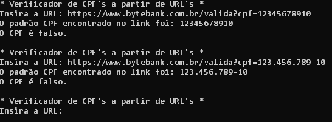

# desafio-string

Seu sistema irá fazer uma consulta para validar CPF, passando como único parâmetro na URL o número do CPF de um determinado cliente. A URL ficará desse jeito:

https://www.bytebank.com.br/valida?cpf=123.456.789-10
ou
https://www.bytebank.com.br/valida?cpf=12345678910

Utilizando expressões regulares, crie um código em Python que extraia somente o número do CPF desta URL, e que também permita extrair CPF sem os pontos e o traço.

Ao buscar o CPF, faça escreva na tela com a função print().
